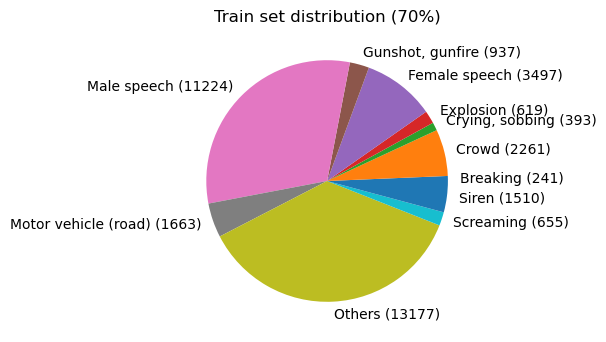
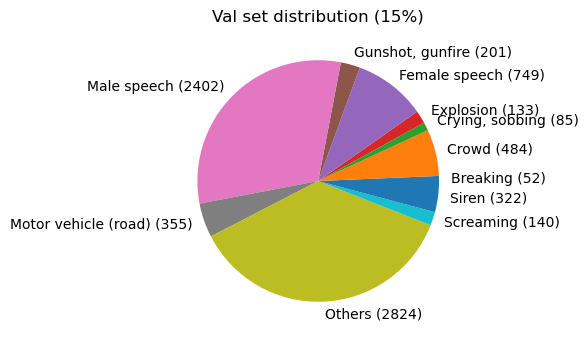
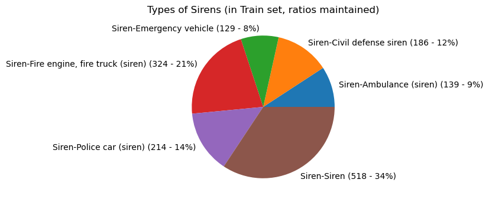

# Project ST Dataset `22.8.30`
The dataset is a subset of Audioset. The current `22.8.30` (August 30 2022) version of the dataset has a total of `51,689` datapoints.

## Specs
Each datapoint is a 10s `.wav` mono audio file, at `16kHz` sample rate.
Each file is saved with its class in its filename. 
For example: `Breaking-00568.wav` belongs to the `Breaking` class.

## Classes
The current dataset has 12 main classes:
*   Breaking
*   Crowd
*   Crying, sobbing
*   Explosion
*   Female speech
*   Gunshot, gunfire
*   Male speech
*   Motor vehicle (road)
*   others
*   Screaming
*   Siren
    *   Siren-Ambulance (siren)
    *   Siren-Civil defense siren
    *   Siren-Emergency vehicle
    *   Siren-Fire engine, fire truck (siren)
    *   Siren-Police car (siren)
    *   Siren-Siren
*   Silence

The filename labels are exactly as listed above.

Siren has further 6 subclasses.

The data is split into `Training (70%)`, `Testing (15%)`, and `Validation (15%)` sets.
Each split is present in its own directory. 

## Class distributions:

#### Distribution amongst the Siren class:

